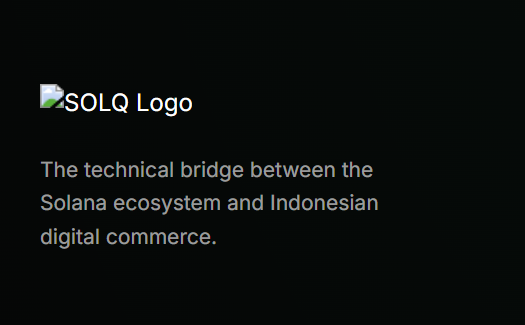
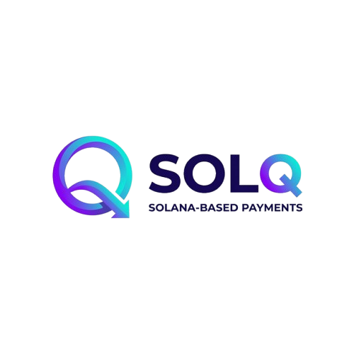

# SOLQ | Payment Orchestration Infrastructure

SOLQ is a professional, non-custodial payment orchestrator designed for the Solana ecosystem. It enables efficient, low-latency bridging between digital assets and standard payment networks.

## 🏛️ Corporate Branding Library
The following are the official branding assets of SOLQ.

| Asset | Format | Preview | Path |
|-------|--------|---------|------|
| **Full Logo (Transparent)** | PNG |  | `assets/logo_full.png` |
| **Q Icon (Transparent)** | PNG |  | `assets/logo_q.png` |
| **Full Logo (Standard)** | JPG | - | `assets/logo_full.jpg` |
| **Q Icon (Standard)** | JPG | - | `assets/logo_q.jpg` |

## 🚀 Technical Architecture Overview

### 1. Payment Orchestration
- **Deterministic Bridging**: Designed for reliable connectivity between digital wallets and standard commerce networks.
- **Engineered Integrity**: High-precision payload processing with strict state-machine validation.

### 2. Market Integrity
- **Orchestrated Oracles**: Integrated market data feeds ensure transparent market-driven rates.
- **Risk Mitigation**: Built-in deviation thresholds and operational safeguards for every transaction.

### 3. Institutional Reliability
- **Enterprise Standards**: Developed with modern security protocols, audit logging, and observability.
- **Scalable Architecture**: Engineered for high-throughput environments with automated reconciliation capabilities.

---
**Status: SOLANA MAINNET · PILOT PROGRAM**
